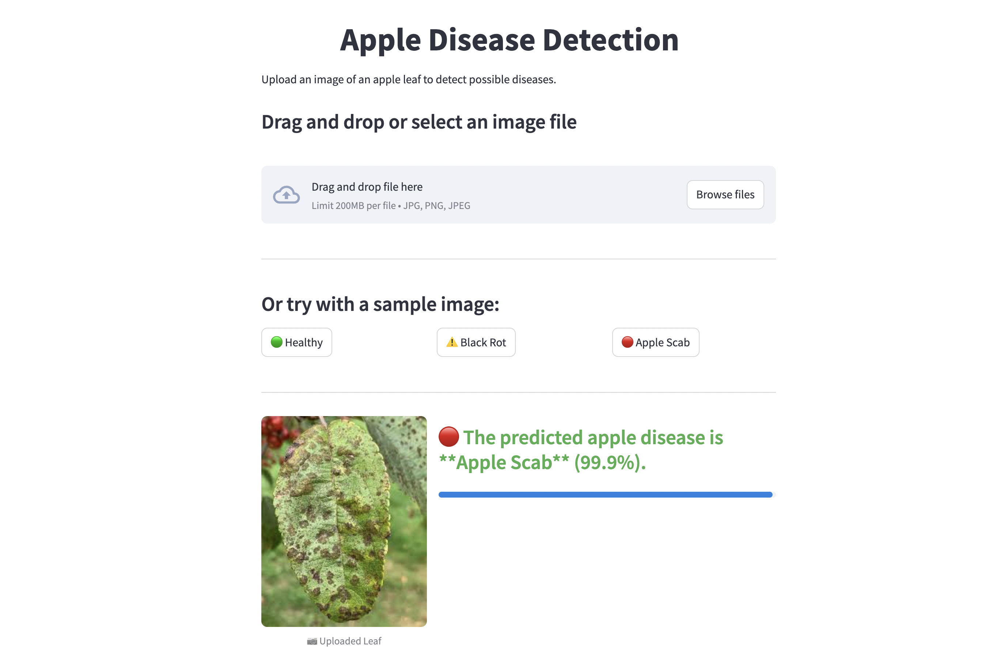

# Apple Leaf Disease Detection with TensorFlow

This project is a lightweight, production-ready web application for detecting diseases in apple leaves using a pre-trained TensorFlow model. The app is built with Streamlit and allows users to upload leaf images or test the system with sample images.

## 🔍 Project Overview

- **Goal:** Detect the presence of common apple leaf diseases such as Black Rot, Apple Scab, or Rust.
- **Input:** JPG/PNG image of a single apple leaf.
- **Output:** Disease classification with confidence score.
- **Interface:** Minimal and responsive web UI with drag-and-drop support and preloaded samples.

## App Preview

## How It Works

Under the hood, this app uses a custom Convolutional Neural Network built with TensorFlow/Keras and several advanced building blocks:

- **Avg2MaxPooling**  
  A bespoke pooling layer that subtracts twice the max-pooled features from the average-pooled ones to sharpen edge and lesion details.

- **SEBlock** (Squeeze-and-Excitation)  
  A channel-wise attention mechanism that re-weights feature maps via global pooling and two dense layers, improving the network’s focus on disease patterns.

- **DepthwiseSeparableConv**  
  A lightweight convolution combining depthwise and pointwise convolutions, augmented with an SEBlock and residual projection for efficiency without sacrificing accuracy.

**Inference pipeline**  
1. Load and cache the model (with custom layers) at startup.  
2. Read uploaded or sample image via OpenCV, resize to 224×224 and normalize.  
3. Run a forward pass through the model to obtain class probabilities.  
4. Display the top prediction and confidence on the Streamlit UI with a progress bar.

This combination of custom layers and streamlined preprocessing yields fast, accurate detection of apple leaf diseases.  

## Tech Stack

- **Model:** TensorFlow / Keras
- **Frontend:** Streamlit
- **Preprocessing:** OpenCV, NumPy
- **Deployment-ready:** Designed for local or cloud-based deployment

## 📁 Project Structure

